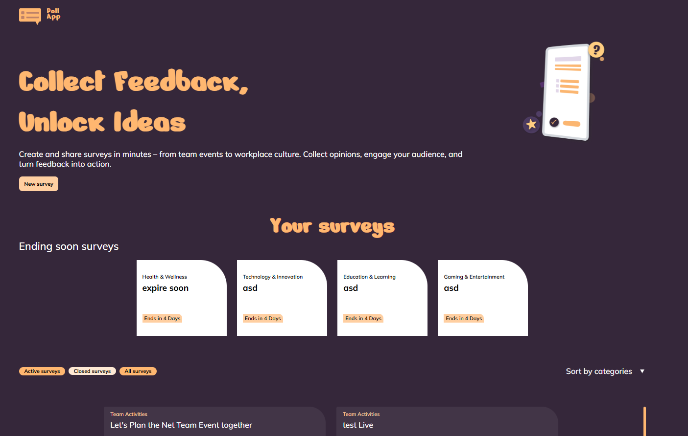

# 📊 Poll App – Collect Feedback, Unlock Ideas

Poll App is a browser-based survey application built as a **learning project** to explore **Angular** and **Supabase**.
The goal was to gain practical experience with modern frontend development, reactive forms, and realtime database integration while creating a clean and intuitive polling platform.

---

## 📌 Overview

Poll App enables users to create, manage, and participate in surveys.
Surveys are organized by their current status, allowing users to easily distinguish between active and completed polls.
Results are updated live, providing instant feedback as participants submit their answers.

---

## 🎯 Learning Goals

- Learn modern Angular development
- Build reactive forms with Angular
- Integrate **Supabase** as backend and database
- Manage application state using Angular
- Work with CRUD operations (Create, Read, Update, Delete)
- Display realtime data updates
- Structure scalable Angular applications

---

## 🛠️ Tech Stack

- **Angular 21** – Frontend framework
- **TypeScript** – Application logic
- **SCSS** – Styling
- **Supabase** – Database & Backend
- **RxJS** – Reactive programming

---

## 📋 Survey Management

Users can create and manage surveys directly within the application.

### Survey Statuses

Each survey is automatically categorized into one of two sections:

- **Running Surveys** – Active surveys that are currently accepting responses
- **Finished Surveys** – Closed surveys that can no longer be edited or answered

---

## 📊 Live Results

One of the core features of Poll App is its realtime result display.

As users submit their votes, the survey statistics are updated instantly, allowing participants to see live feedback without refreshing the page.

---

## ✨ Features

- Create new surveys
- Edit existing surveys
- Delete surveys
- View all running surveys
- Browse finished surveys
- Automatic survey status handling
- Live updating results
- Responsive user interface

---

## 🗄️ Database

The application uses **Supabase** for storing survey data and responses.

Data is synchronized in realtime, allowing multiple users to interact with the same survey simultaneously.

---

## 🚀 Learning Focus

This project was created primarily to gain hands-on experience with:

- Angular architecture
- Standalone Components
- Reactive Forms
- Signals
- Dependency Injection
- Routing
- Supabase integration
- Realtime database updates

---

## 🔗 Live Demo

🎯 Try Poll App here:  
👉 https://pollappp.sebastian-buenz.de/

---

## 🖥️ Preview



---

## 🖥️ Local Setup

1. Clone the repository

```bash
git clone <https://github.com/batti251/PollApp.gitrepository-url>
```

2. Install dependencies

```bash
npm install
```

3. Create your Supabase environment file

```ts
export const environment = {
  supabaseUrl: 'YOUR_SUPABASE_URL',
  supabaseKey: 'YOUR_SUPABASE_ANON_KEY'
};
```

4. Start the development server

```bash
ng serve
```

5. Open your browser at

```
http://localhost:4200
```

---

## 📄 License

This project was created for educational and portfolio purposes.

© 2026 – Sebastian Bünz